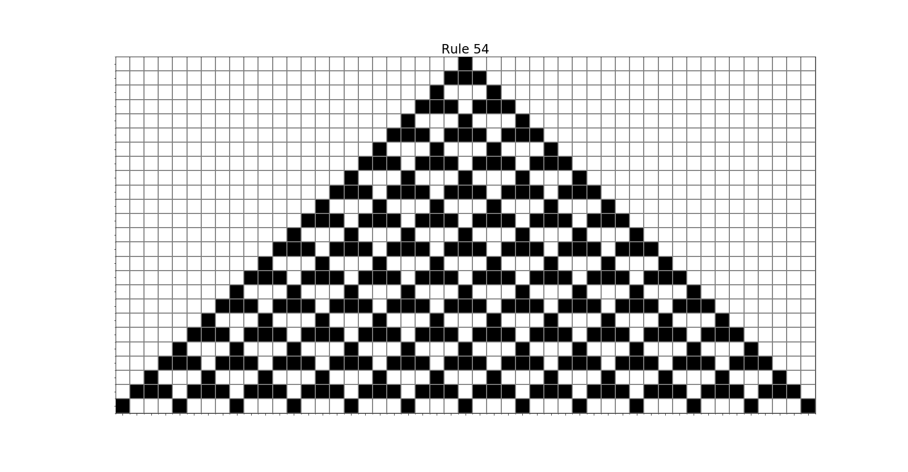

# Cellular Automata

Cellular automata experiments
- [Elementary Cellular Automata](notebooks/elementary-cellular-automata.ipynb) (images below)
- [Elementary Cellular Automata, with random flipping of cell values](notebooks/elementary-cellular-automata-probabilistic.ipynb)
- [Elementary Cellular Automata, based on four neighbouring cells](notebooks/elementary-cellular-automata-four-cells.ipynb)

